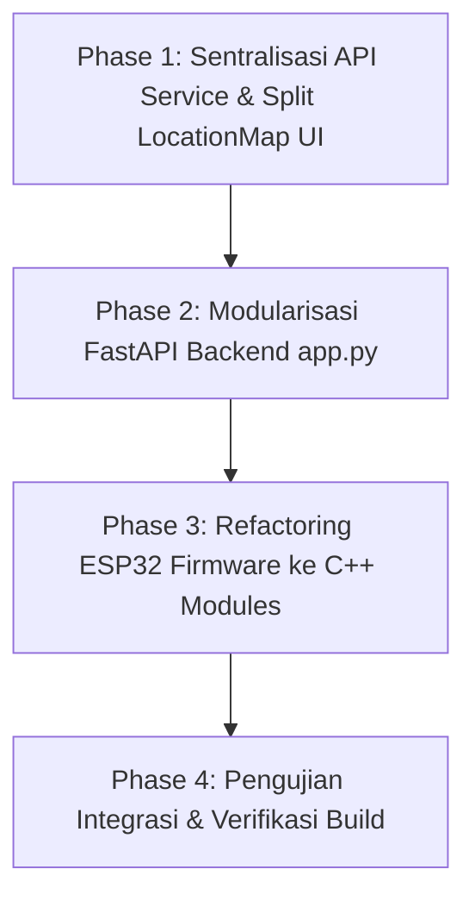

# 🚀 Rencana Refactoring Komprehensif: AquaSentry

Dokumen ini berisi rencana refactoring arsitektur sistem **AquaSentry** untuk meningkatkan keterbacaan (*readability*), pemeliharaan (*maintainability*), modularitas (*modularity*), dan performa di seluruh layer (Frontend React, Backend FastAPI, dan Firmware ESP32).

---

## 📌 1. Ringkasan & Tujuan Refactoring

### Tujuan Utama:
1. **Pemisahan Tanggung Jawab (*Separation of Concerns*)**: Memecah komponen/monolith berukuran besar menjadi modul-modul kecil berorientasi fungsi (*Single Responsibility Principle*).
2. **Keteraturan Jalur Data (*Data Flow Standardization*)**: Memeriksakan fungsi API service tersentralisasi agar tidak ada `fetch()` yang tercecer di berbagai UI component.
3. **Peningkatan Skalabilitas Codebase**: Memudahkan integrasi fitur baru tanpa risiko *side-effects* pada komponen existing.
4. **Struktur Firmware Modular**: Memisahkan logika Arduino C++ monolithic `.ino` menjadi *Header & Source Files* (`.h` / `.cpp`).

---

## 🧩 2. Phase 1: Frontend Refactoring (React + Vite)

### ⚠️ Masalah Utama Saat Ini:
- `LocationMap.jsx` bertindak sebagai *god component* (>900 baris) yang menangani rendering peta Leaflet, state wizard modal 2-step, deteksi GPS, pin picker interaktif, filter status risiko, grid kartu lokasi, dan detail sidebar lokasi.
- Panggilan API HTTP `fetch()` ditulis langsung (*ad-hoc*) di dalam event handler komponen.

### 🛠️ Rencana Refactoring Frontend:

#### A. Pemecahan `LocationMap.jsx` Menjadi Sub-Komponen Modular
- **`src/components/map/MapCanvas.jsx`**:
  - Khusus menangani inisialisasi Leaflet map instance, tile layer OpenStreetMap, dan teardrop marker rendering.
- **`src/components/map/LocationFilterBar.jsx`**:
  - Komponen dropdown filter kondisi risiko (`Semua Status`, `Aman`, `Waspada`, `Bahaya`).
- **`src/components/map/LocationCardGrid.jsx`**:
  - Grid kartu lokasi di bawah peta beserta penanganan state kosong (*empty fallback UI*).
- **`src/components/map/LocationDetailSidebar.jsx`**:
  - Panel rincian informasi parameter air (TDS, Turbiditas, ARI, ASS Score, Rekomendasi Kesehatan, Catatan Lapangan) untuk titik lokasi terpilih.
- **`src/components/map/LocationWizardModal.jsx`**:
  - Modal wizard 2-step untuk penandaan lokasi baru (Step 1: Opsi GPS vs Pin Picker, Step 2: Form Keterangan & Auto-fill Histori Telemetri).

#### B. Sentralisasi Service API (`src/services/api.js`)
- Membuat file sentral untuk semua HTTP request backend (`FETCH_TELEMETRY`, `GET_LOCATIONS`, `SAVE_LOCATION`, `SCAN_WIFI`, `CHECK_HEALTH`).
- Memudahkan penanganan error, timeout, dan konfigurasi `BASE_URL`.

---

## 🐍 3. Phase 2: Backend Refactoring (FastAPI Monolith)

### ⚠️ Masalah Utama Saat Ini:
- `backend/app.py` berisi seluruh endpoint API, pemindaian WiFi sistem operasi Windows (`netsh`), manajemen file JSON persistent, pemrosesan telemetri, dan logika CORS dalam satu file monolith (~430 baris).

### 🛠️ Rencana Refactoring Backend:

#### Struktur Folder Baru:
```
backend/
├── app/
│   ├── __init__.py
│   ├── main.py                  # Entrypoint FastAPI & CORS setup
│   ├── config.py                # Konfigurasi konstanta & env
│   ├── routes/
│   │   ├── telemetry.py         # POST /api/telemetry, GET /api/telemetry/latest
│   │   ├── locations.py         # GET /api/locations, POST /api/locations
│   │   └── wifi.py              # GET /api/wifi/scan, POST /api/wifi/connect
│   ├── services/
│   │   ├── location_service.py  # Operasi baca/tulis locations_saved.json
│   │   ├── wifi_service.py      # Pemindaian netsh wlan Windows
│   │   └── ml_service.py        # Logika inference ML / Rule-based
│   └── models/
│       └── schemas.py           # Pydantic schemas (TelemetryPayload, LocationPayload)
├── locations_saved.json
└── app.py                       # Retained wrapper entrypoint for backward compatibility
```

---

## ⚡ 4. Phase 3: Firmware Refactoring (ESP32 C++)

### ⚠️ Masalah Utama Saat Ini:
- `Dummy_aquasentry_esp32.ino` menampung semua fungsi Captive Portal, NVS Preferences, sampling sensor 5 Hz, Edge AI inference, RGB LED control, dan HTTP WiFi client dalam satu file `.ino`.

### 🛠️ Rencana Refactoring ESP32 Firmware:

#### Pemisahan Header & Source Files (`.h` / `.cpp`):
1. **`ConfigPortal.h / ConfigPortal.cpp`**:
   - Menangani Access Point `AquaSentry-Setup`, DNS Server, dan Captive Portal HTML web server (IP `192.168.4.1`).
2. **`StorageManager.h / StorageManager.cpp`**:
   - Menangani NVS (`Preferences.h`) untuk menyimpan SSID & Password WiFi.
3. **`EdgeAIEngine.h / EdgeAIEngine.cpp`**:
   - Menangani sampling sensor 5 Hz, perhitungan ARI, ASS Score, dan inference model Edge AI.
4. **`StatusIndicator.h / StatusIndicator.cpp`**:
   - Menangani pengontrolan warna RGB Status LED (Hijau = Aman, Kuning = Waspada, Merah = Bahaya).
5. **`WebSyncClient.h / WebSyncClient.cpp`**:
   - Menangani pengiriman payload JSON telemetri via HTTP POST ke backend server.

---

## 📊 5. Plan Timeline & Urutan Eksekusi



| Tahap | Fokus Utama | Target Deliverable |
| :--- | :--- | :--- |
| **Tahap 1** | Frontend Split | Split `LocationMap.jsx` menjadi 5 sub-komponen terpisah & buat `src/services/api.js`. |
| **Tahap 2** | Backend Split | Pecah `app.py` menjadi `routes/`, `services/`, dan `schemas.py` dengan Pydantic models. |
| **Tahap 3** | Firmware Split | Pecah `.ino` menjadi modul C++ (`ConfigPortal`, `EdgeAIEngine`, `StorageManager`). |
| **Tahap 4** | Verification | Verifikasi `npm run build`, uji endpoint `/api/locations` & `/api/telemetry`, serta uji simulasi ESP32. |

---

## 🔍 6. Rencana Verifikasi & Pengujian

- **Automated Frontend Build Check**: `npm run build` (Memastikan 0 error transpilation).
- **Backend API Testing**: Menguji `GET /api/health`, `GET /api/locations`, `POST /api/locations`, dan `GET /api/telemetry/latest`.
- **Integration Test**: Menguji penandaan lokasi baru dari React UI dan memastikan data tersimpan dengan benar tanpa dummy data initial.
